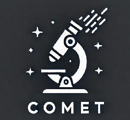

**Cost-function Optimized Maximal Overlap Drift EsTimation**

[](https://colab.research.google.com/github/gpufit/Comet/blob/master/Colab_notebooks/COMET.ipynb)

## Overview

**COMET** is a fast, GPU-accelerated software package for drift correction in single-molecule localization microscopy (SMLM) datasets. It achieves high spatial and temporal resolution by maximizing spatiotemporal overlap across frames using a cost-function optimization approach.

---

## How to Use

### 1. Try Online via COMET Web Tool

Visit our web platform at [smlm.tools](https://www.smlm.tools), upload your dataset, and get results directly without any installation required.

#### Prepare your file:

* Format: CSV (ThunderSTORM-compatible)
* Required headers: `"frame"`, `"x [nm]"`, `"y [nm]"`, and optionally `"z [nm]"`
* Column headers must match exactly (quotes included)
* Extra columns are allowed

[ThunderSTORM reference](https://zitmen.github.io/thunderstorm/)

#### Upload and Run:

1. Upload your file on [smlm.tools](https://www.smlm.tools)
2. Choose:

   * Segmentation method (e.g. segment by number of localizations per time window)
   * Segmentation parameter (e.g. 500 locs per time window)
   * The maximum drift expected in nm
3. Click **Run**

#### Tips:

* ✅ Check *"Keep file for later"* to re-analyze with different settings
* ✅ Check *"Spline Interpolation"* to get a smooth result per frame
* ✅ Check *"Dynamic downsampling"* if you experience memory errors on very large datasets
* ⏳ Busy? If queue times are high, use the Python/Colab version locally.

---

### 2. Run Locally (Python Package & CLI)

**Requirements**

* Python 3.8+
* CUDA-capable GPU (for full acceleration) compatible with Numba CUDA
* (All other dependencies—NumPy, SciPy, Matplotlib, Pandas, h5py, Numba, tqdm, scikit-learn, lmfit—are installed automatically.)

#### Installation

```bash
git clone https://github.com/gpufit/Comet
cd Comet
cd Python_interface
pip install -e .
```

> This creates an “editable” install so that any changes to the code reflect immediately.

To test the installation, run:

```bash
comet_self_test --plot 
```

#### CLI Usage

Once installed, you have a `comet` command available in your environment:

```bash
comet \
  --input       your_data.csv \
  --output      corrected.csv \
  --format      csv \
  --segmentation_mode 2 \
  --segmentation_var 60
```

To see all options:

```bash
comet --help
```

#### Key CLI Parameters

* `--input` (string, **required**): Path to your input file (`.csv` or `.h5`).
* `--output` (string, **required**): Where to save the corrected output.
* `--format` (csv|h5, **required**): Output file format.
* `--segmentation_mode` (0|1|2, default=2):

  * `0`: Fixed number of time windows (`--segmentation_var` = number of segments)
  * `1`: Fixed number of localizations per window (`--segmentation_var` = locs per segment)
  * `2`: Fixed number of frames per window (`--segmentation_var` = frames per segment)
* `--segmentation_var` (int, **required**): Value associated with your chosen mode.
* `--initial_sigma_nm` (float, default=600): Initial Gaussian sigma (nm) for overlap optimization.
* `--target_sigma_nm` (float, default=1): Target sigma (nm) at which the algorithm stops refining.
* `--max_drift` (float, default=None): Maximum expected drift (nm); defaults to `3 × initial_sigma_nm`.
* `--boxcar_width` (int, default=1): Width of the moving-average filter applied between iterations.
* `--interpolation` (cubic|catmull-rom, default=cubic): Interpolation method for per-frame drift curves.

You can omit any optional parameters to use their default values.

---

### 3. Python API

If you prefer to call COMET directly in Python:

```python
from comet.core.drift_optimizer import comet_run_kd
from comet.core.io_utils import load_thunderstorm_csv, save_dataset_as_thunderstorm_csv

# Load your CSV
dataset = load_thunderstorm_csv("your_data.csv")

# Run drift correction
drift, corrected = comet_run_kd(
    dataset,
    segmentation_mode=2,
    segmentation_var=60,
    initial_sigma_nm=600,
    target_sigma_nm=1,
    max_drift=None,
    boxcar_width=1,
    interpolation_method="cubic",
    return_corrected_locs=True
)

# Save as CSV
save_dataset_as_thunderstorm_csv(corrected, "corrected.csv")
```

---

### 4. Google Colab Notebook

Click the badge above to launch the interactive version in your browser with no setup required.

---


## Documentation

This repository also ships developer documentation built with [MkDocs](https://www.mkdocs.org/) and the [Material theme](https://squidfunk.github.io/mkdocs-material/).  
It includes usage guides, background, and an auto-generated API reference.

### Build locally

After installing COMET with `pip install -e .`, install the documentation extras:

```bash
pip install mkdocs mkdocs-material mkdocstrings[python] pymdown-extensions
```

Then build and serve the docs:

```bash
mkdocs serve
```

Open your browser at http://127.0.0.1:8000

## Segmentation Modes

COMET segments data before estimating drift. Choose from:

| Mode | Description                             | Parameter                 |
| ---- | --------------------------------------- | ------------------------- |
| 0    | Fixed number of time windows            | Number of segments        |
| 1    | Fixed number of localizations/window    | Localizations per segment |
| 2    | Fixed number of frames/window (default) | Frames per segment        |

---

## Citation

> If you use COMET in your research, please cite our upcoming publication (link TBD).

---

## Contact

For questions or contributions, feel free to open an issue or reach out on GitHub.
