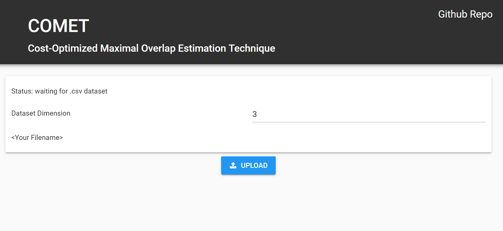
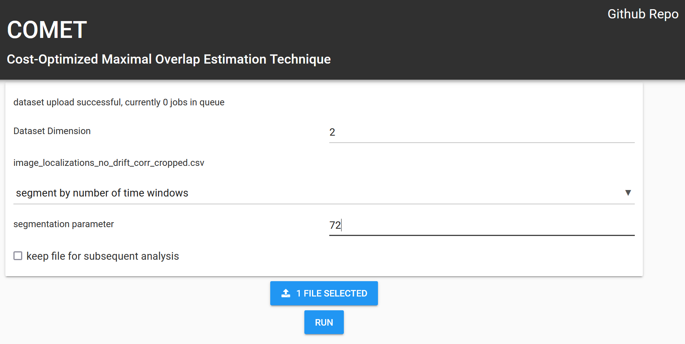

# COMET 
Cost-function Optimized Maximal overlap drift EsTimation

## Introduction

COMET is a software package designed to correct drift in single molecule localization (SMLM)
datasets with a high spatial and temporal resolution. 

## Usage 

### COMET Website 

The easiest way to use COMET is to go to our [dedicated website](https://www.smlm.tools), upload your 
file and let it run on our machine.

#### Step 1

Bring your dataset in the Thunderstorm dataformat:

- .csv file, comma separated
- the following headers: "frame", "x [nm]", "y [nm]" ("z [nm]" for 3D datasets) 
  - -> the "" are part of the header! 
  - the file can have more columns/headers, but the above-mentioned **have to be there**
- check the [Thunderstorm page](https://zitmen.github.io/thunderstorm/) for reference 

#### Step 2

Go to [https://www.smlm.tools](https://www.smlm.tools), press upload and select your 
correctly formatted .csv file

 

#### Step 3
After the upload is finished, you have to specify the dimension of the dataset, 
the segmentation method and the segmentation parameter depending on the 
segmentation method (s. Segmentation Methods for more detailed explaination).
Press run.

- **Tip #1**: If you're unsure about the segmentation, check the "keep file for 
subsequent analysis" checkbox, to be able to run the analysis again 
with different parameters, without the need to upload the file again

- **Tip #2**: After the successful upload of the file, the server will check how 
many jobs are currently queued, it's that's alot, check out the other methods 
to use the COMET analysis described later. 

#### Step 4
After your job is done, a diagram showing the drift curve should appear, 
together with a download button. Press the download button to automatically
download a .csv file containing the drift estimates. 

### Google Colab Notebook
Click on the google colab badge at the top of this README and follow the instructions of the notebook

## Additional Information
### Segmentation Methods 

3 options to segment the dataset:

1) **segment by number of time windows**: 

this divides the dataset in equal parts containing a fixed 
number of localizations, you can specify the number of parts. 

2) **segments by number of locs per window**

similar to option 1)
but here you have to specify the number of localizations per 
window and the resulting number of segments is calculated. 

3) **segment by number of frames per window**:

this will use the information provided by the dataset and split the dataset in unequal parts, where each part contains all the localizations witin a number of frames that you specify.

